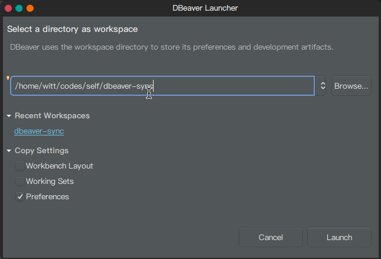

# dbeaver-connection-search
DBeaver connection decryption query script

## Install
### Linux

* ArchLinux / Manjaro

`yay -S dbeaver-connection-search`

## Usage

On DBeaver Click **File** -> **Switch Workspace** --> **Other...** to view the workspace path.

* decrypt all passwords:

`dbeaver-connection-search -d /dbeaver-workspace`

* search connection info:

`dbeaver-connection-search -d /dbeaver-workspace -f mysql`